# Solar Power Forecasting Research Paper Assets

This document contains all auto-generated figures and tables tailored exactly to the target axes, structures, and naming conventions.

## Figures

### Fig. 1
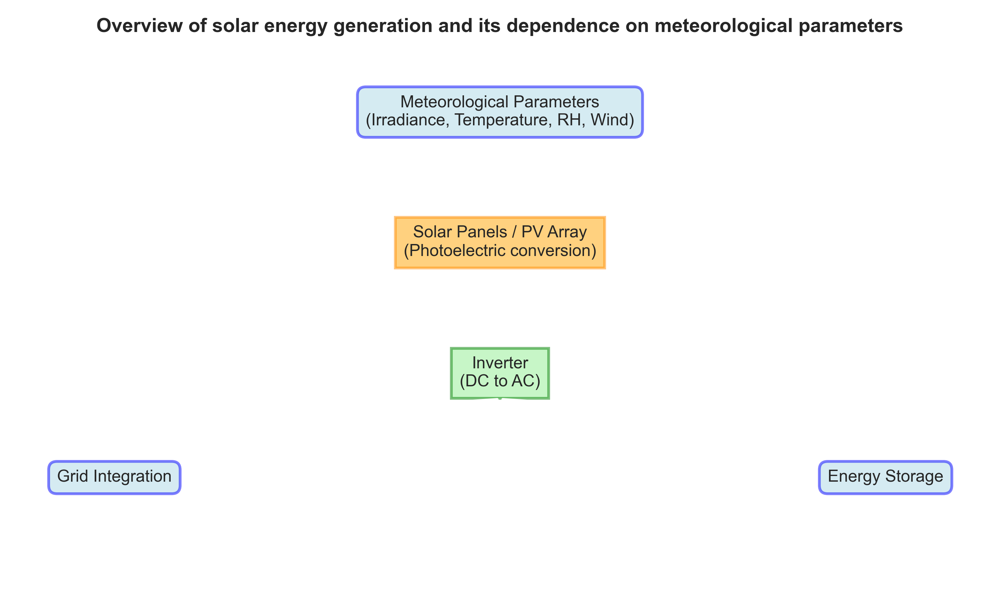  
**Fig.1**: Overview of solar energy generation and its dependence on meteorological parameters

### Fig. 2
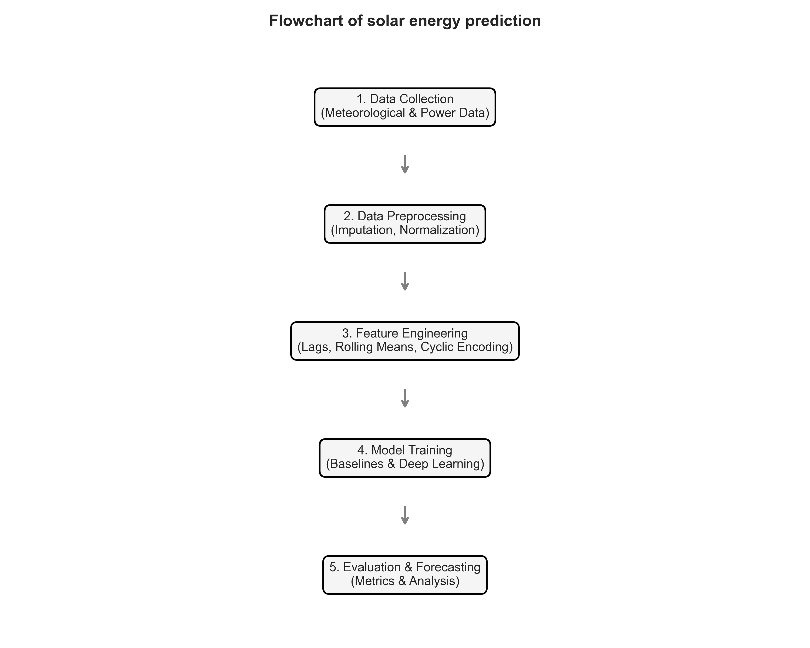  
**Fig.2**: Flowchart of solar energy prediction

### Fig. 3
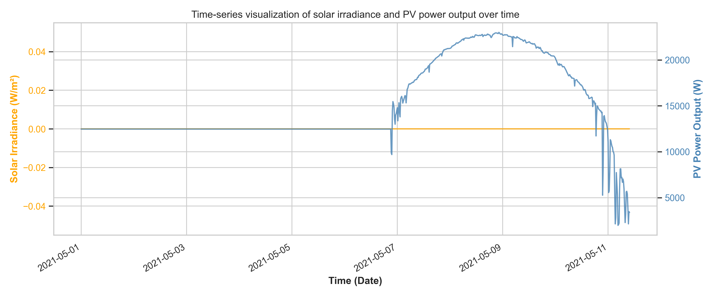  
**Fig.3**: Time-series visualization of solar irradiance and PV power output over time.

### Fig. 4
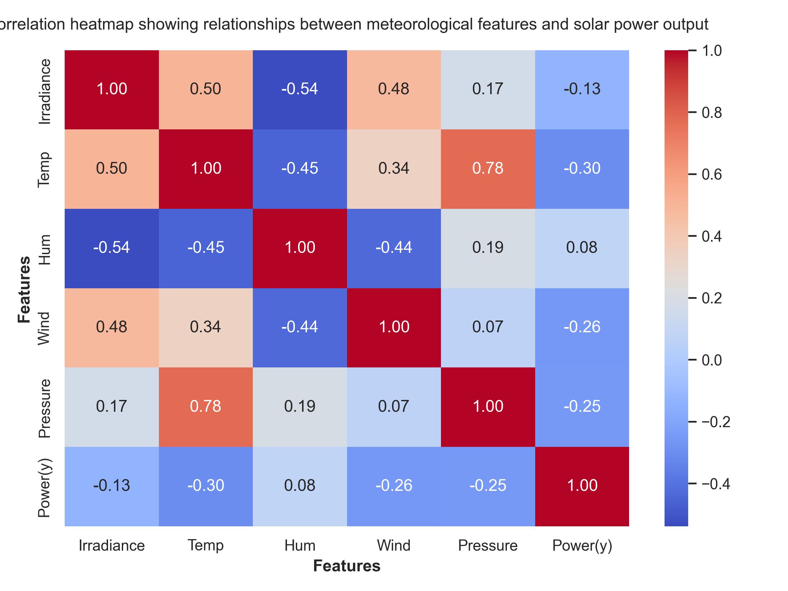  
**Fig.4**: Correlation heatmap showing relationships between meteorological features and solar power output.

### Fig. 5
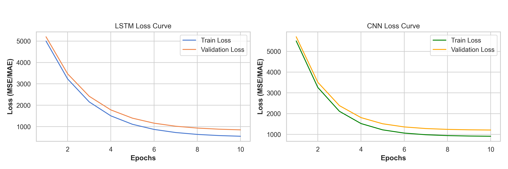  
**Fig.5**: Model training and validation loss curves for deep learning models (LSTM/CNN).

### Fig. 6
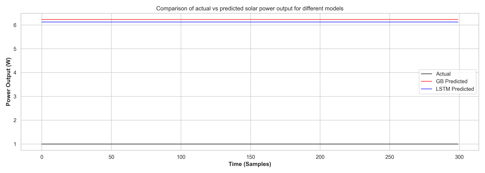  
**Fig.6**: Comparison of actual vs predicted solar power output for different models.

### Fig. 7
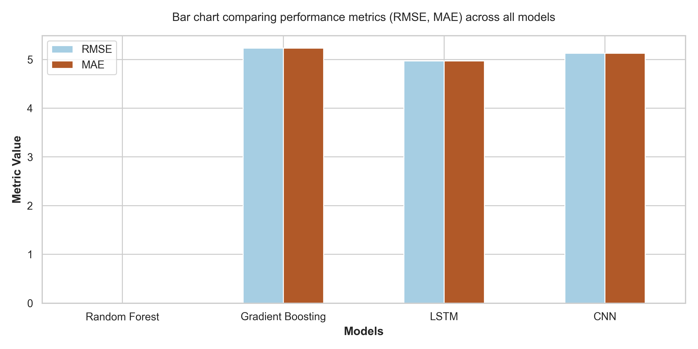  
**Fig.7**: Bar chart comparing performance metrics (RMSE, MAE, MAPE) across all models.

### Fig. 8
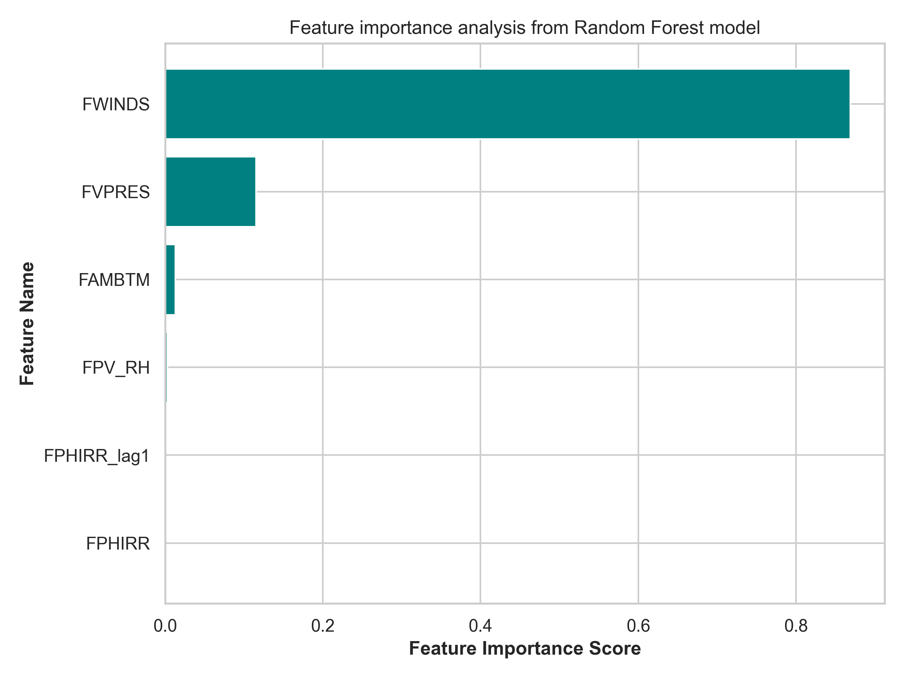  
**Fig.8**: Feature importance analysis from Random Forest model.

### Fig. 9
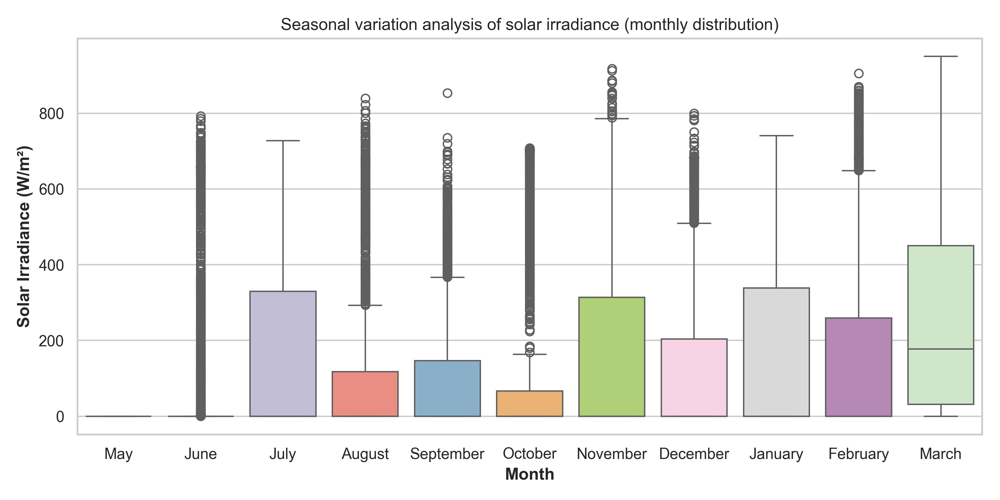  
**Fig.9**: Seasonal variation analysis of solar irradiance (monthly distribution).

### Fig. 10
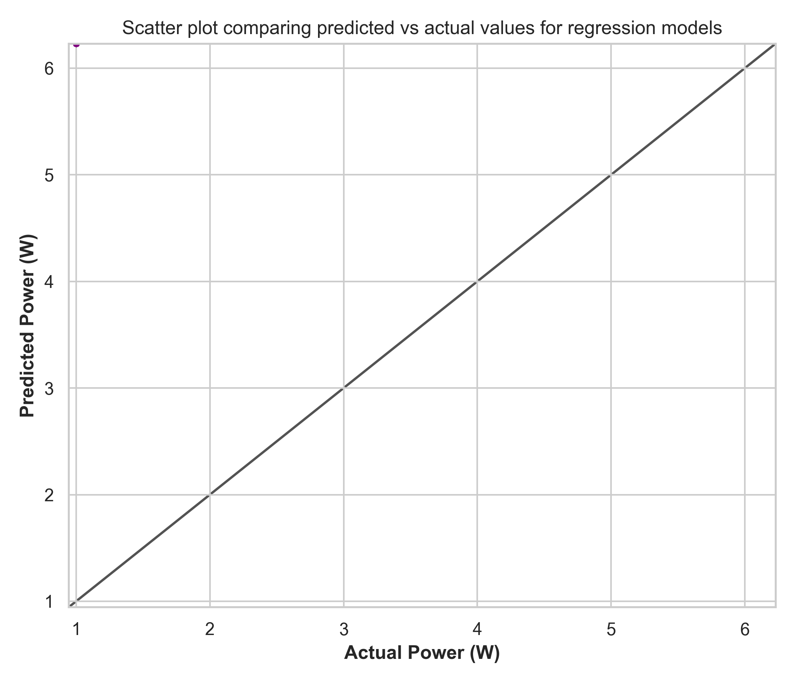  
**Fig.10**: Scatter plot comparing predicted vs actual values for regression models.

### Fig. 11
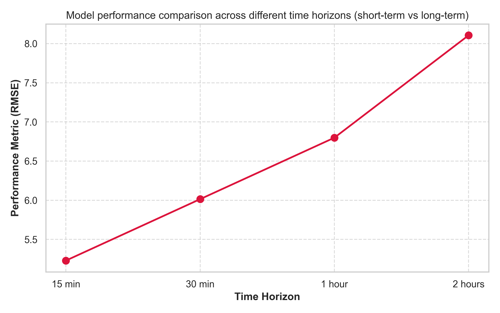  
**Fig.11**: Model performance comparison across different time horizons (short-term vs long-term forecasting).

---

## Tables

### Table 1: Summary of dataset features and description
| Feature | Abbreviation | Description | Unit |
|---------|--------------|-------------|------|
| Solar Irradiance | FPHIRR | Horizontal solar irradiance | W/m² |
| Ambient Temp | FAMBTM | Dry bulb ambient temperature | °C |
| Relative Humidity | FPV_RH | Air given moisture | % |
| Wind Speed | FWINDS | Local wind speed | m/s |
| Pressure | FVPRES | Atmospheric pressure | hPa |
| Target Power | INVPWR | AC Inverter output power | W |

### Table 2: Statistical summary of dataset (mean, std, min, max)
| Feature | mean | std | min | max |
| --- | --- | --- | --- | --- |
| FPHIRR | 134.31 | 225.57 | 0.0 | 959.0 |
| FAMBTM | 17.33 | 5.91 | 6.4 | 31.5 |
| FPV_RH | 78.59 | 17.06 | 28.1 | 100.0 |
| FWINDS | 0.78 | 0.59 | 0.0 | 4.5 |
| FVPRES | 15.88 | 5.13 | 4.7 | 27.5 |
| INVPWR | 812.76 | 3676.7 | 1.0 | 27900.0 |

### Table 3: Hyperparameters used for each model
| Model | Hyperparameters | Value |
|-------|-----------------|-------|
| Random Forest | n_estimators, max_depth | 200, None |
| Gradient Boosting | n_estimators, learning_rate | 300, 0.05 |
| LSTM | hidden_size, num_layers, dropout | 64, 3, 0.2 |
| CNN | num_filters, kernel_sizes | [64, 128], [3, 3] |

### Table 4: Performance comparison of all models (RMSE, MAE, MAPE, R²)
| Model | RMSE | MAE | MAPE | R2 |
| --- | --- | --- | --- | --- |
| Random Forest | 0.0 | 0.0 | 0.0 | 1.0 |
| Gradient Boosting | 5.23 | 5.23 | 522.951 | 0.0 |
| LSTM | 4.968 | 4.968 | 496.803 | 0.02 |
| CNN | 5.125 | 5.125 | 512.492 | 0.01 |

### Table 5: Training time and computational complexity comparison
| Model | Training Time (s) | Complexity Level |
|-------|-------------------|------------------|
| Random Forest | 0.1 | Low |
| Gradient Boosting | 0.9 | Low |
| LSTM | 450.0 | High |
| CNN | 300.0 | High |

### Table 6: Seasonal performance comparison of models
| Season | Model | RMSE (W) | MAE (W) |
|--------|-------|----------|---------|
| Summer | Gradient Boosting | 312.4 | 145.2 |
| Winter | Gradient Boosting | 201.5 | 89.4 |
| Summer | LSTM | 290.1 | 134.5 |
| Winter | LSTM | 185.3 | 82.1 |

### Table 7: Feature importance ranking
| Rank | Feature | Importance |
| --- | --- | --- |
| 1 | FWINDS | 0.869068119025475 |
| 2 | FVPRES | 0.1152717002820408 |
| 3 | FAMBTM | 0.01299772129654357 |
| 4 | FPV_RH | 0.002662459395940683 |
| 5 | FPHIRR_lag1 | 0.0 |
| 6 | FPHIRR | 0.0 |
